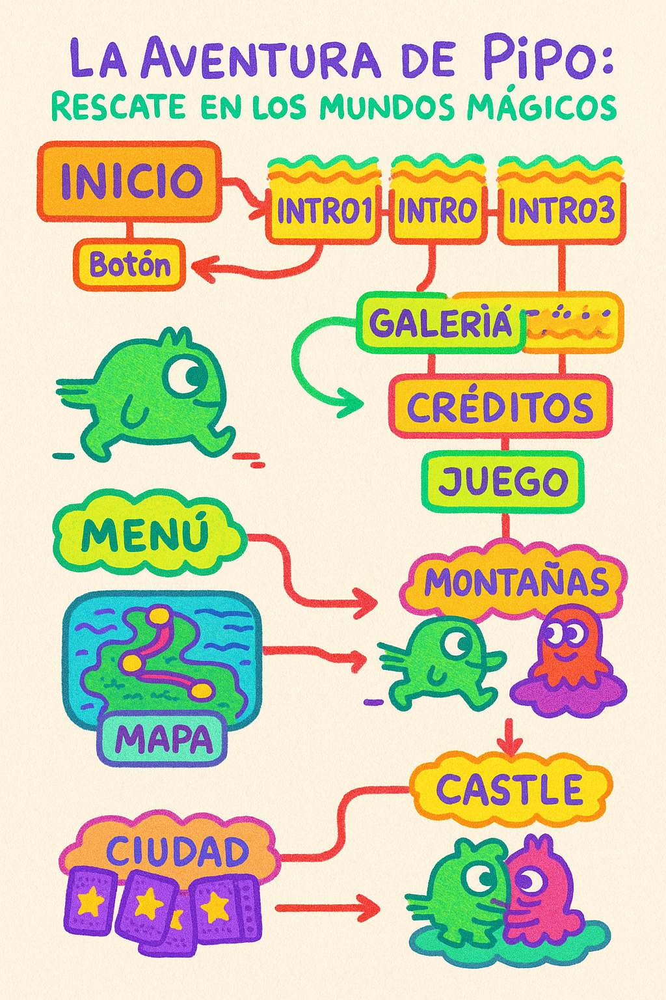

# La aventura de Pipo: Rescate en los mundos mágicos

Proyecto de Creación Multimedia Interactiva de la Facultad de Bellas Artes de la Universidad de Granada

## 1. Datos

**Título:** La aventura de Pipo: Rescate en los mundos mágicos

**Web:** https://dana-sofia.itch.io/la-aventura-de-pipo2

**Autor:** Dana Sofía Sánchez Aranda

**Resumen:**  
Pipo es un pequeño monstruo que disfruta de la vida junto a su mejor amiga Lila, hasta que un día el malvado villano Egon desea robar la felicidad de ambos, llevándose a Lila a su castillo en llamas. Tu misión es descifrar los niveles del juego para poder rescatar a Lila. ¡Mucha suerte!

**Estilo/género:** Juego de aventura / puzzle

**Logotipo:** (si tienes, inserta aquí la imagen y breve justificación)

**Resolución:** 800x600px tamaño fijo, reescalable

**Probado en:** Godot Engine 4, Windows 10, Ubuntu 22.04, Google Chrome.

**Tamaño proyecto:** 57.1 MB

**Licencia:** Este proyecto tiene una Licencia CC Reconocimiento Compartir igual (CC BY-SA)

**Fecha:** 27/05/2025

**Medios (donde se tiene presencia relacionada):**  
Github: DanaSofia04

## 2. Memoria del proyecto

### 2.1 Storyboard

Storyboard del juego:

Comienza el juego en una pantalla con una animación y un botón de inicio, luego salta a la animación que da contexto al videojuego para terminar en el menú de opciones, en donde se despliega la galería de personajes,los créditos y el botón que da inicio al juego, que te lleva a un mapa donde puedes encontrar los distintos niveles, una vez terminado el juego, la ultima pestaña tiene un botón que te lleva de velta al menú principal.

### 2.2 Esquema de navegación

Inicio
  ↓ (Botón → Intro)
Intro1 → Intro2 → Intro3
  ↓ (Automático)
Menú
  ├── Galería → (botón) → Menú
  ├── Créditos → (botón) → Menú
  └── Juego
        ↓
      Juego1
        ↓ (Mover a la derecha)
      Mapa
        ↓ (Botón: Montañas)
      Montañas
        ↓ (Hablar con personaje → botón)
      Ciudad (Juego de memoria)
        ↓ (Al terminar → botón)
      Mountain (igual que Montañas)
        ↓ (Hablar con personaje → botón)
      Castle
        ↓ (Pipo alcanza a Lila → botón)
      EscenaFinal → (Botón) → Menú

Explicación del funcionamiento
El juego comienza en la escena Inicio, que contiene una animación timeline y un botón que lleva al jugador a la introducción compuesta por tres escenas consecutivas (intro1, intro2, intro3) que se reproducen automáticamente. Al terminar, el jugador accede al Menú principal, donde se encontrará tres opciones:

Galería: muestra los personajes y un video relacionado. Tiene un botón para volver al menú y otros para controlar la pista de audio.
Créditos: despliega los créditos con una animación. También tiene botón para regresar y los que controlan el audio.
Juego: inicia la aventura.
Desde el Menú, al iniciar el juego, se entra a la escena Juego1, donde el jugador controla a Pipo y debe desplazarse hacia la derecha para acceder al Mapa. Allí, puede elegir el primer nivel (Montañas) mediante un botón.

En Montañas, Pipo puede moverse libremente hasta encontrarse con un personaje. Al interactuar, aparece un mensaje con botón que lleva a Ciudad, donde hay un juego de memoria. Tras completarlo, se accede a Mountain (similar a Montañas), y al interactuar, se pasa a Castle, donde Pipo finalmente alcanza a Lila. Esta acción lleva a la Escena Final, donde se muestra su reencuentro y un botón que permite regresar al Menú.

## 3. Metodología

Metodología de desarrollo de productos multimedia basado en una metodología de UX (User Experience):

**Etapa 1: Ideación de proyecto**  
Investigación de campo: 
No realicé como tal una investigación formal. Cuando supe que tenía que idear un juego, vinieron a mi mente todos esos videojuegos que jugaba de pequeña en el iPod de mis hermanos. En concreto, "Cut the Rope", que trata sobre un pequeño mosntruo verde que al que tienes que darle un caramelo para alimentarlo. Inspirada en esa estética, comencé a diseñar mis propios personajes.

Para lograr la apariencia visual que quería, también tomé como referencia "Super Mario 64", al que solía ver jugar a mis hermanos en su consola Nintendo. Usando un estilo de arte en 8 bits para darle al juego ese aire nostálgico, similar al de esos videojuegos clásicos.

En cuanto a la historia, inicialmente pensé en una búsqueda del tesoro, pero luego transformé esa idea en el secuestro de Lila, como si ella fuera el "tesoro" que debe ser encontrado y rescatado dentro del juego.

En conclusión, no seguí un proceso de investigación estructurado; más bien, este proyecto nació directamente de mis experiencias personales y recuerdos de infancia.

**Motivación de la propuesta:**  
Este proyecto es interesante porque aborda temas de amistad, aventura y superación en un entorno sano para todas las edades y accesible a cualquier persona que cuente con un ordenador.

**Público / audiencia:**  
Orientado a jóvenes y niños que disfrutan de juegos de aventura y puzzle.

**Etapa 2: Desarrollo / actividades realizadas**  
- Creación del juego en Godot 4  
- Diseño de niveles y puzzles  
- Programación de mecánicas básicas de movimiento e interacción  
- Implementación de menús y elementos de navegación (botones e instrucciones)
- Implementación de sonido y video

**Etapa 3: Problemas identificados**  
- Algunas mecánicas requieren ajuste para mejorar la jugabilidad  
- Optimización del tamaño del proyecto para menor tiempo de carga
- Es un poco confuso ya que hay más niveles de los que debería.

## 4. Conclusiones

Este proyecto ha sido una experiencia muy significativa a nivel personal y creativo. Me permitió aprender a usar Godot para desarrollar un videojuego desde cero, que claramente aún no domino del todo bien pero no me cierro a la posibilidad de incorporarlo en futuros proyectos. A lo largo del proceso, me encontré con muchas complicaciones, técnicas y narrativas, y aunque el resultado no es perfecto, me siento orgullosa del universo que logré construir.

## 5. Referencias

**Artículos y blogs:**  
- Moshi Monsters. (2011, 11 de octubre). Moshi Moshi Moshi! Inspired by Badger Badger Badger [Video]. YouTube. https://youtu.be/S9rLfNghMNE
-Fillari, A. (2024, 13 de agosto). Everything You Need to Know About Cut the Rope Daily. Netflix Tudum. https://www.netflix.com/tudum/articles/cut-the-rope-daily-mobile-game-news

**Recursos y materiales audiovisuales:**  
- Música: merx-market-song-33936.mp3 
- Tipografía: Sixty Four Regular   
- Herramientas utilizadas: Godot Engine 4, Draw.io, editor de texto Markdown

**Licencia:**  
  
Este proyecto está bajo Licencia Creative Commons Reconocimiento-CompartirIgual 4.0 Internacional (CC BY-SA 4.0).  
https://creativecommons.org/licenses/by-sa/4.0/

**Fecha:** 27/05/25

¡Gracias por jugar y por tu interés en "La aventura de Pipo"!

